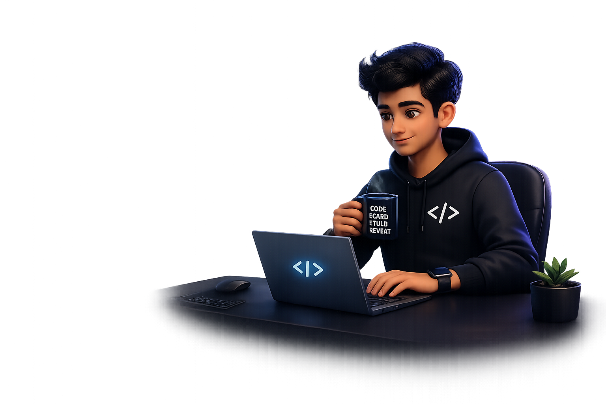

<!-- ========================= HERO SECTION ========================= -->
<table>
<tr>
<td width="56%" valign="middle">

# Hi 👋, I'm Yeddula Gangadhar

### MERN Stack Developer | Python Full-Stack Learner | AI/ML Enthusiast

Passionate about building **full-stack applications**, solving **real-world problems**, and growing as a **Full-Stack Developer + AI/ML Engineer**.

  
  

  

</td>

<td width="44%" align="right" valign="middle">
  
</td>
</tr>
</table>

---

# 🚀 About Me

- 🎓 B.Tech student in **Computer Science Engineering (AI & ML)**
- 💻 Passionate about **MERN Stack Development, Python Full-Stack, and AI/ML**
- 🌱 Currently learning **React.js, Node.js, Express.js, MongoDB, FastAPI**
- 🛠️ I enjoy building **real-world projects** and improving my coding skills
- 📚 Working on **DSA, backend development, and full-stack applications**
- 🎯 Goal: **Full-Stack Developer + AI/ML Engineer**

---

# 🛠️ Tech Stack

### 👨‍💻 Languages

  
  
  
  

### 🌐 Frontend

  
  
  

### ⚙️ Backend

  
  
  

### 🗄️ Database

  
  

### 🧰 Tools

  
  
  
  

---

# 📊 GitHub Stats

  
  

  

---

# 💼 Experience

## MERN Stack Developer Intern
- Built full-stack applications using **MongoDB, Express.js, React.js, and Node.js**
- Worked on **REST APIs, CRUD operations, and frontend-backend integration**

## AI & Machine Learning Intern
- Learned **ML fundamentals, data preprocessing, and model evaluation**
- Worked on **predictive analytics and machine learning concepts**

---

# 🌟 Featured Projects

<table>
<tr>
<td width="50%" valign="top">

## 📌 Placement Portal
Full-stack placement management application for handling placement-related activities.

**Tech:** React, Node.js, MongoDB, FastAPI  
🔗 **Repo:** [View Project](https://github.com/gangadharyeddula)

</td>

<td width="50%" valign="top">

## 📌 BMI Calculator
A simple and responsive BMI calculator project with clean UI and beginner-friendly logic.

**Tech:** HTML, CSS, JavaScript / Python  
🔗 **Repo:** [View Project](https://github.com/gangadharyeddula)

</td>
</tr>

<tr>
<td width="50%" valign="top">

## 📌 Python Mini Projects
A collection of Python mini projects for learning, practice, and logic building.

**Tech:** Python  
🔗 **Repo:** [View Project](https://github.com/gangadharyeddula)

</td>

<td width="50%" valign="top">

## 📌 AI / ML Projects
Mini machine learning and AI projects focused on experimentation and practical understanding.

**Tech:** Python, ML Libraries  
🔗 **Repo:** [View Project](https://github.com/gangadharyeddula)

</td>
</tr>
</table>

---

# 📈 Current Focus

- 🔭 Building **full-stack web applications**
- ⚡ Working with **FastAPI, Node.js, MongoDB**
- 📘 Practicing **Data Structures & Algorithms**
- 🤖 Exploring **AI/ML concepts and mini projects**
- 🚀 Improving clean code, backend logic, and project structure

---

# 🌐 Connect With Me

  
  
  

---

  

<h3 align="center">“The best way to predict the future is to build it.”</h3>
